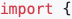
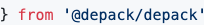

# @depack/depack

[](https://npmjs.org/package/@depack/depack)

`@depack/depack` is The Source Code For Depack's JavaScript API. [_Depack_](https://github.com/dpck/depack) is the compiler of _Node.JS_ packages into a single executable, as well as the bundler for JavaScript web files using _Google Closure Compiler_. It scans the entry files to detect all dependencies, to passes them to _GCC_.

```sh
yarn add @depack/depack
```

## Table Of Contents

- [Table Of Contents](#table-of-contents)
- [API](#api)
- [`async run(args, opts=): string`](#async-runargs-arraystringopts-runconfig-string)
  * [`RunConfig`](#type-runconfig)
- [`async Compile(options, runOptions=, compilerArgs=): string`](#async-compileoptions-compileconfigrunoptions-runconfigcompilerargs-arraystring-string)
  * [`CompileConfig`](#type-compileconfig)
- [`async Bundle(options, runOptions=, compilerArgs=): string`](#async-bundleoptions-bundleconfigrunoptions-runconfigcompilerargs-arraystring-string)
  * [`BundleConfig`](#type-bundleconfig)
- [`getOptions(options): !Array<string>`](#getoptionsoptions-getoptions-array)
  * [`GetOptions`](#type-getoptions)
- [`getOutput(output, src=): string`](#getoutputoutput-stringsrc-string-string)
- [`GOOGLE_CLOSURE_COMPILER: string`](#googleclosurecompiler-string)
- [`async getCompilerVersion(): string`](#async-getcompilerversion-string)
- [Copyright](#copyright)

<p align="center"><a href="#table-of-contents">
  
</a></p>

## API

The package is available by importing its named functions:

<table>
<tr/>
<tr><td>
<a href="#api"></a><br>
&nbsp;&nbsp;&nbsp;&nbsp;<a href="#async-compileoptions-compileconfigrunoptions-runconfigcompilerargs-arraystring-string">Compile</a>, <a href="#async-bundleoptions-bundleconfigrunoptions-runconfigcompilerargs-arraystring-string">Bundle</a>, <a href="#async-runargs-arraystringopts-runconfig-string">run</a>,<br>
&nbsp;&nbsp;&nbsp;&nbsp;<a href="#getoptionsoptions-getoptions-array">getOptions</a>, <a href="#getoutputoutput-stringsrc-string-string">getOutput</a>,<br>
&nbsp;&nbsp;&nbsp;&nbsp;GOOGLE_CLOSURE_COMPILER, getCompilerVersion,<br>
<a href="#api"></a>
</td></tr>
</table>

<p align="center"><a href="#table-of-contents">
  
</a></p>

## <code>async <ins>run</ins>(</code><sub><br/>&nbsp;&nbsp;`args: !Array<string>,`<br/>&nbsp;&nbsp;`opts=: !RunConfig,`<br/></sub><code>): <i>string</i></code>
Low-level API used by `Compile` and `Bundle`. Spawns _Java_ and executes the compilation. To debug a possible bug in the _GCC_, the sources after each pass can be saved to the file specified with the `debug` command. Also, _GCC_ does not add `// # sourceMappingURL=output.map` comment, therefore it's done by this method. Returns `stdout` of the _Java_ process. Returns the _stdout_ of the Java process.

 - <kbd><strong>args*</strong></kbd> <em><code>!Array&lt;string&gt;</code></em>: The arguments to Java.
 - <kbd>opts</kbd> <em><code><a href="#type-runconfig" title="General options for running of the compiler.">!RunConfig</a></code></em> (optional): General options for running of the compiler.

__<a name="type-runconfig">`RunConfig`</a>__: General options for running of the compiler.
<table>
 <thead><tr>
  <th>Name</th>
  <th>Type &amp; Description</th>
  <th>Default</th>
 </tr></thead>
 <tr>
  <td rowSpan="3" align="center">output</td>
  <td><em>string</em></td>
  <td rowSpan="3">-</td>
 </tr>
 <tr></tr>
 <tr>
  <td>
   The path where the output will be saved. Prints to <code>stdout</code> if not passed.
  </td>
 </tr>
 <tr>
  <td rowSpan="3" align="center">debug</td>
  <td><em>string</em></td>
  <td rowSpan="3">-</td>
 </tr>
 <tr></tr>
 <tr>
  <td>
   The name of the file where to save sources after each pass. Useful when there's a potential bug in <em>GCC</em>.
  </td>
 </tr>
 <tr>
  <td rowSpan="3" align="center">compilerVersion</td>
  <td><em>string</em></td>
  <td rowSpan="3">-</td>
 </tr>
 <tr></tr>
 <tr>
  <td>
   Used in the display message. Obtained with the <code>getCompilerVersion</code> method.
  </td>
 </tr>
 <tr>
  <td rowSpan="3" align="center">noSourceMap</td>
  <td><em>boolean</em></td>
  <td rowSpan="3"><code>false</code></td>
 </tr>
 <tr></tr>
 <tr>
  <td>
   Disables source maps.
  </td>
 </tr>
</table>

<p align="center"><a href="#table-of-contents">
  
</a></p>

## <code>async <ins>Compile</ins>(</code><sub><br/>&nbsp;&nbsp;`options: !CompileConfig,`<br/>&nbsp;&nbsp;`runOptions=: !RunConfig,`<br/>&nbsp;&nbsp;`compilerArgs=: !Array<string>,`<br/></sub><code>): <i>string</i></code>
Compiles a _Node.JS_ source file with dependencies into a single executable (with the `+x` addition). Performs regex-based static analysis of the whole of the dependency tree to construct the list of JS files. If any of the files use `require`, adds the `--process_common_js_modules` flag. Returns the `stdout` of the compiler, and prints to the console if output is not given in `runOptions`.

 - <kbd><strong>options*</strong></kbd> <em><code><a href="#type-compileconfig" title="Options for the Node.JS package compiler.">!CompileConfig</a></code></em>: Options for the _Node.JS_ package compiler. Must have the `src` prop at least.
 - <kbd>runOptions</kbd> <em><code><a href="1-run.md#type-runconfig" title="General options for running of the compiler.">!RunConfig</a></code></em> (optional): General options for running of the compiler.
 - <kbd>compilerArgs</kbd> <em><code>!Array&lt;string&gt;</code></em> (optional): The compiler args got with `getOptions` and/or manually extended. `getOptions` needs to be called first to find out the compiler's JAR at minimum.

The actual logic that makes compilation of _Node.JS_ packages possible is:

- Scan the source code and dependency to find out what internal Node.JS modules are used, and creates the output wrapper with `require` calls to require those built-in modules, e.g., `const path = require('path')`.
- Add appropriate [externs](https://github.com/dpck/externs) for the internal modules.
- To make Closure resolve internal imports like `import { join } from 'path'` instead of throwing an error, mock the built-ins in `node_modules` folder. The mocks will reference the variable from the output wrapper generated in step 1:
    ```js
    // node_modules/path/index.js
    export default path
    export * from path
    ```

The last argument, `compilerArgs` can come from the `getOptions` method. The output property should come from `getOutput` method to enable saving to directories without specifying the output filename (_GCC_ will do it automatically, but we need to write source maps and set `+x`).

__<a name="type-compileconfig">`CompileConfig`</a>__: Options for the Node.JS package compiler.
<table>
 <thead><tr>
  <th>Name</th>
  <th>Type &amp; Description</th>
  <th>Default</th>
 </tr></thead>
 <tr>
  <td rowSpan="3" align="center"><strong>src*</strong></td>
  <td><em>string</em></td>
  <td rowSpan="3">-</td>
 </tr>
 <tr></tr>
 <tr>
  <td>
   The entry file to bundle. Currently only single files are supported.
  </td>
 </tr>
 <tr>
  <td rowSpan="3" align="center">noStrict</td>
  <td><em>boolean</em></td>
  <td rowSpan="3"><code>false</code></td>
 </tr>
 <tr></tr>
 <tr>
  <td>
   Removes <code>use strict</code> from the output.
  </td>
 </tr>
 <tr>
  <td rowSpan="3" align="center">verbose</td>
  <td><em>boolean</em></td>
  <td rowSpan="3"><code>false</code></td>
 </tr>
 <tr></tr>
 <tr>
  <td>
   Print all arguments to the compiler.
  </td>
 </tr>
 <tr>
  <td rowSpan="3" align="center">silent</td>
  <td><em>boolean</em></td>
  <td rowSpan="3"><code>false</code></td>
 </tr>
 <tr></tr>
 <tr>
  <td>
   If output is not given, don't print to <code>stdout</code>. By default, the output will be printed.
  </td>
 </tr>
 <tr>
  <td rowSpan="3" align="center">library</td>
  <td><em>boolean</em></td>
  <td rowSpan="3"><code>false</code></td>
 </tr>
 <tr></tr>
 <tr>
  <td>
   Whether to create a library.
  </td>
 </tr>
</table>

_For example, given the following source:_

<table><tr/><tr><td>

<details>
<summary>Click to expand/collapse

```js
import { constants } from 'os'
import { createWriteStream, createReadStream } from 'fs'

// ...
```
</summary>

```js
;(async () => {
  const result = await new Promise((r, j) => {
    const input = process.env['INPUT'] || __filename
    const output = process.env['OUTPUT']
    const rs = createReadStream(input)
    const ws = output ? createWriteStream(output) : process.stdout
    rs.pipe(ws)
    rs.on('error', (err) => {
      if (err.errno === -constants.errno.ENOENT) {
        return j(`Cannot find file ${input}`)
      }
      return j(err)
    })
    rs.on('close', () => {
      r({ input, 'output': output })
    })
  })
  const res = {
    version: process.version,
    ...result,
  }
  console.log(res)
})()
```
</details>
</td></tr></table>

_The library can be used to start the compilation:_

```js
import { getCompilerVersion, Compile, getOptions } from '@depack/depack'

(async () => {
  const compilerVersion = await getCompilerVersion()
  const options = getOptions({
    advanced: true,
    prettyPrint: true,
    languageIn: 2018,
    languageOut: 2017,
  })
  await Compile({
    src: 'example/compile-src.js',
  }, { compilerVersion }, options)
})()
```

_The compiled output in pretty format of advanced optimisation:_
```js
#!/usr/bin/env node
'use strict';
const os = require('os');
const fs = require('fs');             
const {constants:g} = os;
const {createReadStream:h, createWriteStream:k} = fs;
(async() => {
  var d = await new Promise((l, e) => {
    const a = process.env.INPUT || __filename, b = process.env.OUTPUT, c = h(a), m = b ? k(b) : process.stdout;
    c.pipe(m);
    c.on("error", f => f.errno === -g.errno.ENOENT ? e(`Cannot find file ${a}`) : e(f));
    c.on("close", () => {
      l({input:a, output:b});
    });
  });
  d = Object.assign({}, {version:process.version}, d);
  console.log(d);
})();
```

_Stderr:_
<pre>java -jar /Users/zavr/node_modules/google-closure-compiler-java/compiler.jar \
--compilation_level ADVANCED --language_in ECMASCRIPT_2018 --language_out \
ECMASCRIPT_2017 --formatting PRETTY_PRINT --package_json_entry_names module,main \
--entry_point example/compile-src.js --externs node_modules/@depack/externs/v8/os.js \
--externs node_modules/@depack/externs/v8/fs.js --externs \
node_modules/@depack/externs/v8/stream.js --externs \
node_modules/@depack/externs/v8/events.js --externs \
node_modules/@depack/externs/v8/url.js --externs \
node_modules/@depack/externs/v8/global.js --externs \
node_modules/@depack/externs/v8/global/buffer.js --externs \
node_modules/@depack/externs/v8/nodejs.js
Built-ins: os, fs
Running Google Closure Compiler 20190709<a id="_ind0" href="#_ind0"></a>
</pre>

<p align="center"><a href="#table-of-contents">
  
</a></p>

## <code>async <ins>Bundle</ins>(</code><sub><br/>&nbsp;&nbsp;`options: !BundleConfig,`<br/>&nbsp;&nbsp;`runOptions=: !RunConfig,`<br/>&nbsp;&nbsp;`compilerArgs=: !Array<string>,`<br/></sub><code>): <i>string</i></code>
Bundles the browser source code into a _JavaScript_ file. If there are any _JSX_ dependencies, the bundler will transpile them first using [ÀLaMode/JSX](https://github.com/a-la/jsx). Returns the `stdout` of the compiler, and prints to the console if output is not given in `runOptions`.

 - <kbd><strong>options*</strong></kbd> <em><code><a href="#type-bundleconfig" title="Options for the web bundler.">!BundleConfig</a></code></em>: Options for the web bundler. Must have the `src` prop at least.
 - <kbd>runOptions</kbd> <em><code><a href="1-run.md#type-runconfig" title="General options for running of the compiler.">!RunConfig</a></code></em> (optional): General options for running of the compiler.
 - <kbd>compilerArgs</kbd> <em><code>!Array&lt;string&gt;</code></em> (optional): The compiler args got with `getOptions` and/or manually extended.

__<a name="type-bundleconfig">`BundleConfig`</a>__: Options for the web bundler.
<table>
 <thead><tr>
  <th>Name</th>
  <th>Type &amp; Description</th>
  <th>Default</th>
 </tr></thead>
 <tr>
  <td rowSpan="3" align="center"><strong>src*</strong></td>
  <td><em>string</em></td>
  <td rowSpan="3">-</td>
 </tr>
 <tr></tr>
 <tr>
  <td>
   The entry file to bundle. Currently only single files are supported.
  </td>
 </tr>
 <tr>
  <td rowSpan="3" align="center">tempDir</td>
  <td><em>string</em></td>
  <td rowSpan="3"><code>depack-temp</code></td>
 </tr>
 <tr></tr>
 <tr>
  <td>
   Where to save prepared JSX files.
  </td>
 </tr>
 <tr>
  <td rowSpan="3" align="center">preact</td>
  <td><em>boolean</em></td>
  <td rowSpan="3"><code>false</code></td>
 </tr>
 <tr></tr>
 <tr>
  <td>
   Adds <code>import { h } from 'preact'</code> automatically, so that the bundle will be compiled <strong>together</strong> with <em>Preact</em>.
  </td>
 </tr>
 <tr>
  <td rowSpan="3" align="center">silent</td>
  <td><em>boolean</em></td>
  <td rowSpan="3"><code>false</code></td>
 </tr>
 <tr></tr>
 <tr>
  <td>
   If output is not given, don't print to <code>stdout</code>. By default, the output will be printed.
  </td>
 </tr>
 <tr>
  <td rowSpan="3" align="center">preactExtern</td>
  <td><em>boolean</em></td>
  <td rowSpan="3"><code>false</code></td>
 </tr>
 <tr></tr>
 <tr>
  <td>
   Adds <code>import { h } from '＠preact/extern'</code> automatically, assuming that <code>preact</code> will be available in the global scope and won't be included in the compilation. It will also rename any <code>preact</code> imports into <code>＠externs/preact</code>, so that the actual source code does not need manual editing.
  </td>
 </tr>
</table>

_For example, given the following single JS source:_

```js
/* eslint-env browser */
[...document.querySelectorAll('.BananaInactive')]
  .forEach((el) => {
    const parent = el.closest('.BananaCheck')
    el.onclick = () => {
      parent.classList.add('BananaActivated')
    }
  })
;[...document.querySelectorAll('.BananaActive')]
  .forEach((el) => {
    const parent = el.closest('.BananaCheck')
    el.onclick = () => {
      parent.classList.remove('BananaActivated')
    }
  })
```

_Depack is used to make a JS file in ES2015 understood by old browsers:_

```js
import { getCompilerVersion, Bundle, getOptions } from '@depack/depack'

(async () => {
  const compilerVersion = await getCompilerVersion()
  const options = getOptions({
    advanced: true,
    prettyPrint: true,
  })
  await Bundle({
    src: 'example/bundle-src.js',
  }, { compilerVersion }, options)
})()
```

_The bundled output:_
```js
function c(a) {
  var b = 0;
  return function() {
    return b < a.length ? {done:!1, value:a[b++]} : {done:!0};
  };
}
function e(a) {
  if (!(a instanceof Array)) {
    var b = "undefined" != typeof Symbol && Symbol.iterator && a[Symbol.iterator];
    a = b ? b.call(a) : {next:c(a)};
    for (var d = []; !(b = a.next()).done;) {
      d.push(b.value);
    }
    a = d;
  }
  return a;
}
[].concat(e(document.querySelectorAll(".BananaInactive"))).forEach(function(a) {
  var b = a.closest(".BananaCheck");
  a.onclick = function() {
    b.classList.add("BananaActivated");
  };
});
[].concat(e(document.querySelectorAll(".BananaActive"))).forEach(function(a) {
  var b = a.closest(".BananaCheck");
  a.onclick = function() {
    b.classList.remove("BananaActivated");
  };
});
```

_Stderr:_
<pre>java -jar /Users/zavr/node_modules/google-closure-compiler-java/compiler.jar \
--compilation_level ADVANCED --formatting PRETTY_PRINT
--js example/bundle-src.js
Running Google Closure Compiler 20190709<a id="_ind1" href="#_ind1"></a>
</pre>

<p align="center"><a href="#table-of-contents">
  
</a></p>

## <code><ins>getOptions</ins>(</code><sub><br/>&nbsp;&nbsp;`options: !GetOptions,`<br/></sub><code>): <i>!Array<string></i></code>
Returns an array of options to pass to the compiler for `Compile`, `Bundle` and `BundleChunks` methods. [Full list of supported arguments](https://github.com/google/closure-compiler/wiki/Flags-and-Options).

 - <kbd><strong>options*</strong></kbd> <em><code><a href="#type-getoptions" title="Parameters for `getOptions`.">!GetOptions</a></code></em>: The map of options to be converted into Java arguments.

__<a name="type-getoptions">`GetOptions`</a>__: Parameters for `getOptions`.
<table>
 <thead><tr>
  <th>Name</th>
  <th>Type &amp; Description</th>
  <th>Default</th>
 </tr></thead>
 <tr>
  <td rowSpan="3" align="center">compiler</td>
  <td><em>string</em></td>
  <td rowSpan="3">-</td>
 </tr>
 <tr></tr>
 <tr>
  <td>
   The path to the compiler JAR. Default value will be got from <code>require.resolve('google-closure-compiler-java/compiler.jar')</code>.
  </td>
 </tr>
 <tr>
  <td rowSpan="3" align="center">output</td>
  <td><em>string</em></td>
  <td rowSpan="3">-</td>
 </tr>
 <tr></tr>
 <tr>
  <td>
   Sets the <code>--js_output_file</code> flag.
  </td>
 </tr>
 <tr>
  <td rowSpan="3" align="center">chunkOutput</td>
  <td><em>string</em></td>
  <td rowSpan="3">-</td>
 </tr>
 <tr></tr>
 <tr>
  <td>
   Sets the <code>--chunk_output_path_prefix</code> flag.
  </td>
 </tr>
 <tr>
  <td rowSpan="3" align="center">level</td>
  <td><em>string</em></td>
  <td rowSpan="3">-</td>
 </tr>
 <tr></tr>
 <tr>
  <td>
   Sets the <code>--compilation_level</code> flag.
  </td>
 </tr>
 <tr>
  <td rowSpan="3" align="center">advanced</td>
  <td><em>boolean</em></td>
  <td rowSpan="3"><code>false</code></td>
 </tr>
 <tr></tr>
 <tr>
  <td>
   Sets the <code>--compilation_level</code> flag to <code>ADVANCED</code>.
  </td>
 </tr>
 <tr>
  <td rowSpan="3" align="center">languageIn</td>
  <td><em>(string | number)</em></td>
  <td rowSpan="3">-</td>
 </tr>
 <tr></tr>
 <tr>
  <td>
   Sets the <code>--language_in</code> flag. If a year is passed, adjusts it to <code>ECMASCRIPT_{YEAR}</code> automatically.
  </td>
 </tr>
 <tr>
  <td rowSpan="3" align="center">languageOut</td>
  <td><em>(string | number)</em></td>
  <td rowSpan="3">-</td>
 </tr>
 <tr></tr>
 <tr>
  <td>
   Sets the <code>--language_out</code> flag. If a number is passed, adjusts it to <code>ECMASCRIPT_{YEAR}</code> automatically.
  </td>
 </tr>
 <tr>
  <td rowSpan="3" align="center">sourceMap</td>
  <td><em>boolean</em></td>
  <td rowSpan="3"><code>true</code></td>
 </tr>
 <tr></tr>
 <tr>
  <td>
   Adds the <code>--create_source_map %outname%.map</code> flag.
  </td>
 </tr>
 <tr>
  <td rowSpan="3" align="center">prettyPrint</td>
  <td><em>boolean</em></td>
  <td rowSpan="3"><code>false</code></td>
 </tr>
 <tr></tr>
 <tr>
  <td>
   Adds the <code>--formatting PRETTY_PRINT</code> flag.
  </td>
 </tr>
 <tr>
  <td rowSpan="3" align="center">iife</td>
  <td><em>boolean</em></td>
  <td rowSpan="3"><code>false</code></td>
 </tr>
 <tr></tr>
 <tr>
  <td>
   Adds the <code>--isolation_mode IIFE</code> flag.
  </td>
 </tr>
 <tr>
  <td rowSpan="3" align="center">noWarnings</td>
  <td><em>boolean</em></td>
  <td rowSpan="3"><code>false</code></td>
 </tr>
 <tr></tr>
 <tr>
  <td>
   Sets the <code>--warning_level QUIET</code> flag.
  </td>
 </tr>
 <tr>
  <td rowSpan="3" align="center">debug</td>
  <td><em>string</em></td>
  <td rowSpan="3">-</td>
 </tr>
 <tr></tr>
 <tr>
  <td>
   The location of the file where to save sources after each pass. Disables source maps as these 2 options are incompatible.
  </td>
 </tr>
 <tr>
  <td rowSpan="3" align="center">argv</td>
  <td><em>!Array&lt;string&gt;</em></td>
  <td rowSpan="3">-</td>
 </tr>
 <tr></tr>
 <tr>
  <td>
   Any additional arguments to the compiler.
  </td>
 </tr>
</table>

**Example:**

<table><tr/><tr><td>
<details>
<summary><em>Click to show/hide output</em>

```js
import { getOptions } from '@depack/depack'

const opts = getOptions({
  advanced: true,
  iife: true,
  languageIn: 2019,
  languageOut: 2017,
  noWarnings: true,
  prettyPrint: true,
  output: 'bundle.js',
  argv: ['--externs', 'externs.js'],
})
console.log(opts)
```
</summary>

---
```js
[ '-jar',
  '/Users/zavr/node_modules/google-closure-compiler-java/compiler.jar',
  '--compilation_level',
  'ADVANCED',
  '--language_in',
  'ECMASCRIPT_2019',
  '--language_out',
  'ECMASCRIPT_2017',
  '--create_source_map',
  '%outname%.map',
  '--formatting',
  'PRETTY_PRINT',
  '--isolation_mode',
  'IIFE',
  '--warning_level',
  'QUIET',
  '--externs',
  'externs.js',
  '--js_output_file',
  'bundle.js' ]
```
</details>
</td></tr></table>

<p align="center"><a href="#table-of-contents">
  
</a></p>

## <code><ins>getOutput</ins>(</code><sub><br/>&nbsp;&nbsp;`output: string,`<br/>&nbsp;&nbsp;`src=: string,`<br/></sub><code>): <i>string</i></code>
Returns the location of the output file, even when the directory is given.

 - <kbd><strong>output*</strong></kbd> <em>`string`</em>: The path to the output dir or file.
 - <kbd>src</kbd> <em>`string`</em> (optional): The path to the source file. Will be used when the output is a dir.

```js
import { getOutput } from '@depack/depack'

const file = getOutput('test.js')
console.log('File: %s', file)
const dir = getOutput('output', 'index.js')
console.log('Dir: %s', dir)
```
```js
File: test.js
Dir: output/index.js
```

<p align="center"><a href="#table-of-contents">
  
</a></p>

## `GOOGLE_CLOSURE_COMPILER: string`

If the `GOOGLE_CLOSURE_COMPILER` was set using the environment variable, it will be returned in this named exported.

<p align="center"><a href="#table-of-contents">
  
</a></p>

## <code>async <ins>getCompilerVersion</ins>(): <i>string</i></code>
If `GOOGLE_CLOSURE_COMPILER` was set using an environment variable, returns `target`, otherwise reads the version from the `google-closure-compiler-java` package.json file.

<p align="center"><a href="#table-of-contents">
  
</a></p>


## Copyright

<table>
  <tr>
    <th>
      <a href="https://artd.eco">
        
      </a>
    </th>
    <th>© <a href="https://artd.eco">Art Deco</a> for <a href="https://artd.eco/depack">Depack</a> 2019</th>
    <th>
      <a href="https://www.technation.sucks" title="Tech Nation Visa">
        
      </a>
    </th>
    <th><a href="https://www.technation.sucks">Tech Nation Visa Sucks</a></th>
  </tr>
</table>

<p align="center"><a href="#table-of-contents">
  
</a></p>